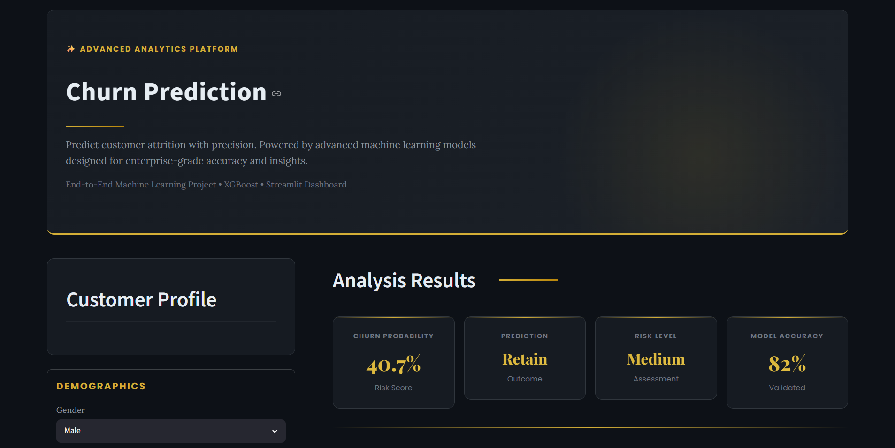
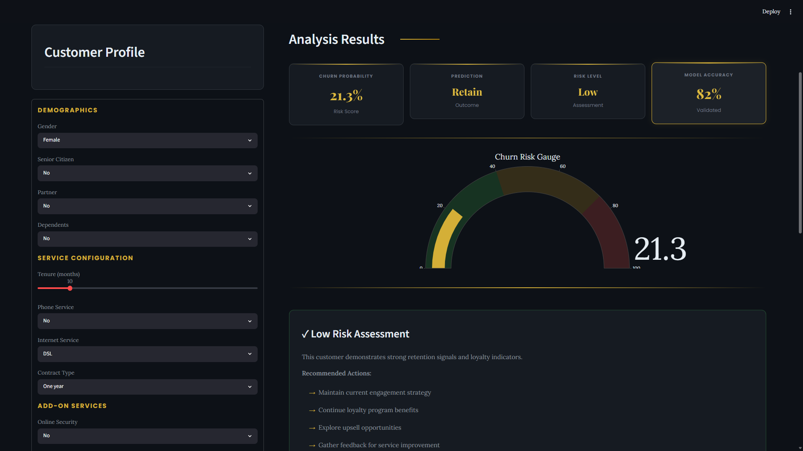
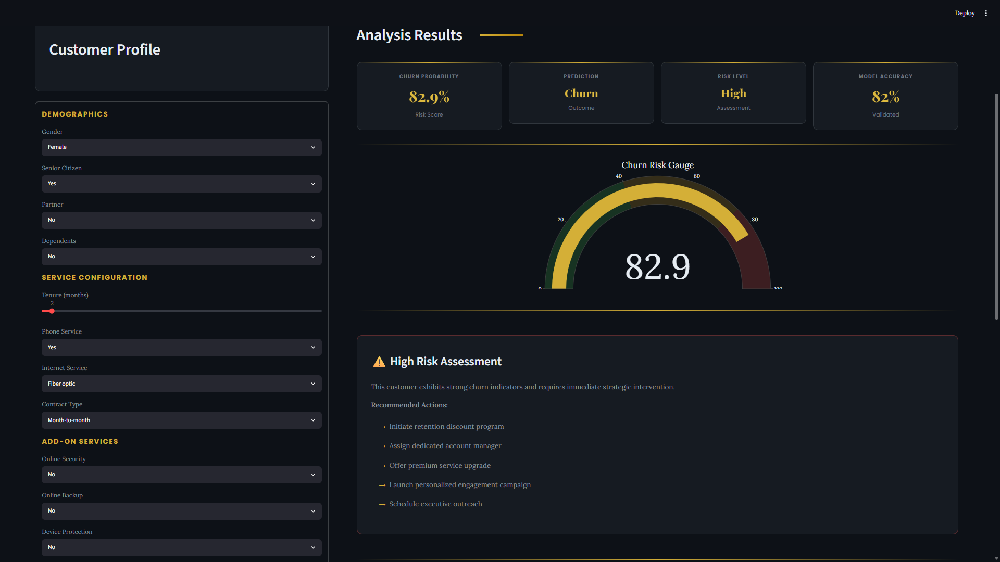

# 📊 Customer Churn Prediction System

An end-to-end Machine Learning project that predicts customer churn using customer demographics, service usage behavior, contract information, and billing details.

The project combines data analysis, feature engineering, machine learning, explainable AI, and an interactive Streamlit dashboard to help businesses identify customers at risk of churn and take proactive retention actions.

---

## 🚀 Project Overview

Customer churn is one of the most important business challenges for subscription-based companies. Losing existing customers directly impacts revenue, growth, and long-term profitability.

This project leverages Machine Learning to analyze customer behavior and predict whether a customer is likely to leave a service. The system provides churn probability, risk assessment, and actionable retention recommendations through an enterprise-style dashboard.

---

## 🎯 Business Objective

The primary objectives of this project are:

- Predict customer churn probability
- Identify high-risk customers
- Support data-driven retention strategies
- Improve customer lifetime value
- Provide interpretable business insights
- Deliver predictions through an interactive dashboard

---

## 📂 Project Structure

```text
customer-churn-prediction/
│
├── app/
│   └── app.py
│
├── data/
│   ├── raw/
│   └── processed/
│
├── models/
│   ├── churn_model.joblib
│   ├── encoders.joblib
│   └── scaler.joblib
│
├── notebooks/
│   ├── 01_data_loading.ipynb
│   ├── 02_eda.ipynb
│   ├── 03_preprocessing.ipynb
│   ├── 04_model_training.ipynb
│   └── 05_feature_importance.ipynb
│
├── reports/
├── screenshots/
├── tests/
├── requirements.txt
├── setup.py
└── README.md
```

---

## 🛠️ Tech Stack

### Programming Language

- Python

### Data Analysis

- Pandas
- NumPy

### Visualization

- Matplotlib
- Seaborn
- Plotly

### Machine Learning

- Scikit-Learn
- XGBoost

### Explainable AI

- SHAP

### Application Framework

- Streamlit

---

## 📊 Dataset Information

The dataset contains customer demographic, service usage, billing, and contract information.

### Key Features

#### Demographics

- Gender
- Senior Citizen
- Partner
- Dependents

#### Service Information

- Phone Service
- Multiple Lines
- Internet Service
- Online Security
- Online Backup
- Device Protection
- Tech Support
- Streaming TV
- Streaming Movies

#### Contract & Billing

- Contract Type
- Paperless Billing
- Payment Method
- Monthly Charges
- Total Charges
- Customer Lifetime Value (CLTV)
- Tenure Months

### Target Variable

```text
Churn Value
```

- 1 → Customer Churned
- 0 → Customer Retained

---

## 🔍 Exploratory Data Analysis (EDA)

Several exploratory analyses were conducted to understand customer behavior and churn patterns.

### Key Insights

- Customers with month-to-month contracts show significantly higher churn rates.
- Lower tenure customers are more likely to churn.
- Customers lacking online security and technical support services exhibit higher churn behavior.
- Higher monthly charges are associated with increased churn probability.
- Customers with longer contracts demonstrate stronger retention patterns.

---

## ⚙️ Data Preprocessing

The following preprocessing steps were performed:

- Missing value handling
- Feature selection
- Categorical encoding
- Data cleaning
- Train-test splitting
- Feature alignment for model inference

Processed datasets were used for machine learning model development and evaluation.

---

## 🤖 Machine Learning Pipeline

### Models Evaluated

- Logistic Regression
- Random Forest Classifier
- XGBoost Classifier

### Final Model

The best-performing model selected was:

```text
XGBoost Classifier
```

The model demonstrated strong predictive capability and effectively captured complex relationships between customer attributes and churn behavior.

---

## 🔎 Model Explainability

SHAP (SHapley Additive exPlanations) was used to interpret model predictions and understand feature importance.

### Important Churn Drivers

- Contract Type
- Tenure Months
- Monthly Charges
- Internet Service
- Payment Method
- Customer Lifetime Value (CLTV)
- Online Security
- Tech Support

These insights help businesses understand why customers are at risk and where intervention efforts should be focused.

---

# 🖥️ Dashboard Preview

## Main Dashboard



The dashboard provides an enterprise-style interface for customer churn analysis, allowing users to input customer information and instantly receive churn predictions.

---

## Low Risk Customer Prediction



Low-risk customers display strong retention signals and loyalty indicators. The system recommends maintaining engagement and loyalty initiatives.

---

## High Risk Customer Prediction



High-risk customers are automatically flagged and accompanied by retention recommendations such as personalized campaigns, discounts, service upgrades, and dedicated support.

---

## ✨ Dashboard Features

- Interactive customer profile input
- Real-time churn prediction
- Churn probability gauge visualization
- Risk-level assessment
- Retention recommendations
- Professional dark-themed interface
- Business-friendly analytics presentation

---

## ▶️ Installation

### Clone Repository

```bash
git clone https://github.com/iamxkhushi1726-svg/customer-churn-prediction.git
```

### Move Into Project Directory

```bash
cd customer-churn-prediction
```

### Install Dependencies

```bash
pip install -r requirements.txt
```

### Launch Application

```bash
streamlit run app/app.py
```

---

## 📈 Business Impact

This project demonstrates how machine learning can be used to:

- Identify customers likely to churn
- Reduce customer attrition
- Improve retention campaigns
- Increase customer lifetime value
- Support strategic business decision-making

---

## 🔮 Future Enhancements

Potential future improvements include:

- Cloud deployment
- REST API integration
- Customer segmentation analysis
- Automated retention workflows
- MLOps pipeline implementation
- Real-time monitoring and model retraining

---

## 👩‍💻 Author

### Khushi

AI & Machine Learning Engineering Student

Interested in:

- Machine Learning
- Data Science
- Predictive Analytics
- Explainable AI
- Intelligent Systems

---

## ⭐ Project Status

```text
Completed
```

End-to-End Customer Churn Prediction System featuring:

✔ Exploratory Data Analysis  
✔ Feature Engineering  
✔ XGBoost Classification Model  
✔ SHAP Explainability  
✔ Interactive Streamlit Dashboard  
✔ Business-Oriented Retention Insights